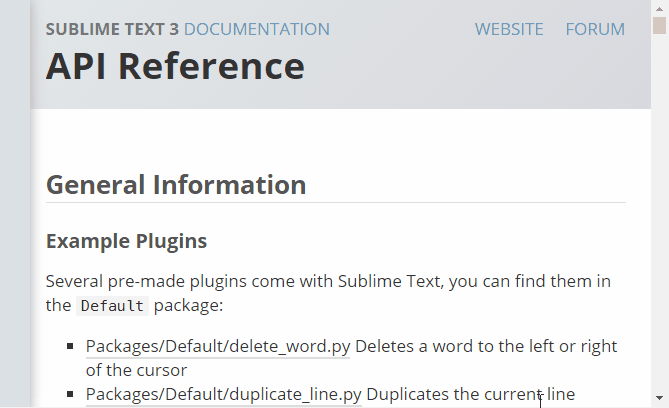

# Sublime API Chrome Extension

Here's what you'll get if you use this extension:

it's not perfect (pretty far from it), but I prefer to have this side bar.

## Installation

As you probably guessed, this is an extension for *Google chrome* only. 

1. Download the [`sublime-api`](http://github.com/math2001/sublime-api-chrome-ext/sublime-api.crx) (you can use [git zip](http://kinolien.github.io/gitzip/))
2. Open the extension chrome page (`chrome://extensions`)
3. Drag the file into this page.

Done! Open [The Sublime Text 3 API](http://www.sublimetext.com/docs/3/api_reference.html).

## Devs

If you want to download the code to change it, or just to make sure you know that the extension you're using is safe (because you can see the code), do the following steps:

1. clone this repo wherever you want on your computer
2. open the extensions chrome page (`chrome://extensions`)
3. click on `Load unpacked extension...`
4. select this repo's folder
5. click `ok`

Done